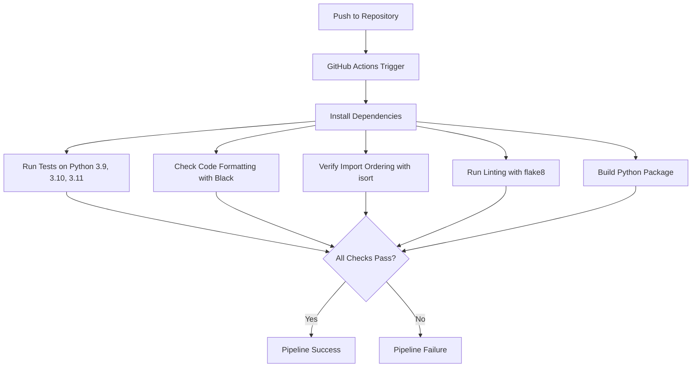
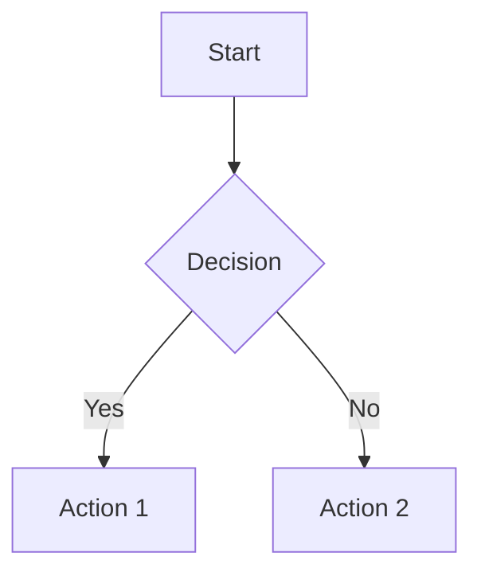
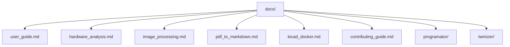
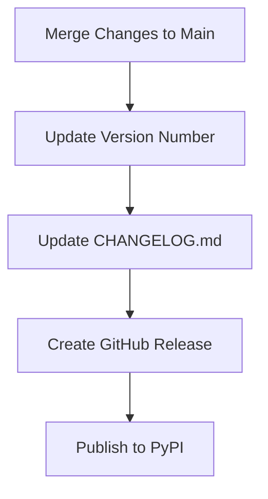

# Contributing to Twinizer

This guide provides detailed information on how to contribute to the Twinizer project, including our development workflow, documentation process, and GitHub integration.

## Development Workflow

### GitHub Actions Pipeline

Twinizer uses GitHub Actions for continuous integration. Our pipeline automatically runs on each push to the main branch and on pull requests.

The pipeline performs the following checks:



### Local Development Setup

1. Clone the repository:
   ```bash
   git clone https://github.com/yourusername/twinizer.git
   cd twinizer
   ```

2. Create a virtual environment and install dependencies:
   ```bash
   python -m venv venv
   source venv/bin/activate  # On Windows: venv\Scripts\activate
   pip install -e ".[dev]"
   ```

3. Run tests to ensure everything is working:
   ```bash
   pytest
   ```

### Code Style

We use the following tools to maintain code quality:

- **Black** for code formatting
- **isort** for import sorting
- **flake8** for linting

Before submitting a pull request, please run:

```bash
black src tests
isort src tests
flake8 src tests
```

## Documentation

### GitHub Pages

Our documentation is hosted on GitHub Pages at [https://yourusername.github.io/twinizer/](https://yourusername.github.io/twinizer/).

The site is automatically built from the Markdown files in the `docs/` directory and the project's README.md.

### Mermaid Diagrams

Twinizer documentation supports Mermaid diagrams, which are automatically rendered when viewed on GitHub or GitHub Pages.

To add a Mermaid diagram to your documentation:

````markdown

````

### Documentation Structure

The documentation is organized as follows:



## Pull Request Process

1. Fork the repo and create your branch from `main`
2. Make your changes, following our code style guidelines
3. Add tests for any new functionality
4. Update documentation as needed
5. Ensure all tests pass and the GitHub Actions pipeline succeeds
6. Submit your pull request with a clear description of the changes

## Release Process

Twinizer follows [Semantic Versioning](https://semver.org/):

- MAJOR version for incompatible API changes
- MINOR version for new functionality in a backwards compatible manner
- PATCH version for backwards compatible bug fixes

The release process is as follows:



## Questions and Support

If you have questions or need support, please:

1. Check the existing documentation
2. Look for similar issues in the GitHub issue tracker
3. Create a new issue with the "question" label if needed

Thank you for contributing to Twinizer!
