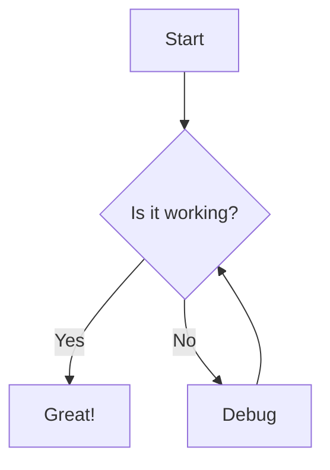

# Image Processing in Twinizer

## Table of Contents
- [Introduction](#introduction)
- [ASCII Art Conversion](#ascii-art-conversion)
- [3D Model Generation](#3d-model-generation)
- [Mermaid Diagram Generation](#mermaid-diagram-generation)
- [Advanced Usage](#advanced-usage)
- [API Reference](#api-reference)

## Introduction

Twinizer provides powerful image processing capabilities that allow you to convert images to various formats and representations. This document covers the main image processing features and provides detailed examples of their usage.

## ASCII Art Conversion

The ASCII art converter transforms images into text-based art using various character sets.

### Command Line Usage

```bash
# Basic usage
twinizer image to-ascii input.jpg --width 80

# With custom character set and output format
twinizer image to-ascii input.jpg --width 100 --charset blocks --format html --output output.html

# With inverted brightness
twinizer image to-ascii input.jpg --width 80 --invert
```

### Python API

```python
from twinizer.converters.image.ascii import AsciiArtConverter

# Create converter
converter = AsciiArtConverter()

# Basic conversion
ascii_art = converter.convert(
    image_path="input.jpg",
    width=80
)
print(ascii_art)

# Advanced conversion
ascii_art = converter.convert(
    image_path="input.jpg",
    width=100,
    height=None,  # Auto-calculate based on aspect ratio
    output_format="html",  # "text", "html", or "ansi"
    charset="blocks",  # "standard", "simple", "blocks", or "extended"
    invert=True,
    output_path="output.html"
)
```

### Character Sets

The ASCII art converter supports several character sets:

- **Standard**: Uses a range of ASCII characters based on brightness
  ```
  .,-:;i+!llI?/\|()1{}[]rcvunxzjftLCJUYXZO0Qoahkbdpqwm*WMB8&%$#@
  ```

- **Simple**: Uses only a few characters for a cleaner look
  ```
  .:-=+*#%@
  ```

- **Blocks**: Uses Unicode block characters for higher resolution
  ```
  ' ░▒▓█
  ```

- **Extended**: Uses extended ASCII characters for more detail
  ```
  $@B%8&WM#*oahkbdpqwmZO0QLCJUYXzcvunxrjft/\|()1{}[]?-_+~<>i!lI;:,"^`'. 
  ```

### Output Formats

- **Text**: Plain text output suitable for console or text files
- **HTML**: HTML output with styling for web display, using `<pre>` tags with CSS
- **ANSI**: Colored terminal output using ANSI escape codes for terminal display

### Examples

#### Text Output
```
@@@@@@@@@@@@@@@@@@@@@@@@@@@@@@@@@@@@@@@@@@@@@@@@@@@@@@@@@@@@@@@@@@@@@@@@@@@@@@@@
@@@@@@@@@@@@@@@@@@@@@@@@@@@@@@@@@@@@@@@@@@@@@@@@@@@@@@@@@@@@@@@@@@@@@@@@@@@@@@@@
@@@@@@@@@@@@@@@@@@@@@@@@@@@@@@@@@@@@@@@@@@@@@@@@@@@@@@@@@@@@@@@@@@@@@@@@@@@@@@@@
@@@@@@@@@@@@@@@@@@@@@@@@@@@@@@@@@@@@@@@@@@@@@@@@@@@@@@@@@@@@@@@@@@@@@@@@@@@@@@@@
@@@@@@@@@@@@@@@@@@@@@@@@@@@@@@@@@@@@@@@@@@@@@@@@@@@@@@@@@@@@@@@@@@@@@@@@@@@@@@@@
@@@@@@@@@@@@@@@@@@@@@@@@@@@@@@@@@@@@@#+=--=+#@@@@@@@@@@@@@@@@@@@@@@@@@@@@@@@@@@@
@@@@@@@@@@@@@@@@@@@@@@@@@@@@@@@@@#=:.          :=#@@@@@@@@@@@@@@@@@@@@@@@@@@@@@@@
@@@@@@@@@@@@@@@@@@@@@@@@@@@@@#=.                  .=#@@@@@@@@@@@@@@@@@@@@@@@@@@@
@@@@@@@@@@@@@@@@@@@@@@@@@#=.                         -+#@@@@@@@@@@@@@@@@@@@@@@@@@
@@@@@@@@@@@@@@@@@@@@@#=:                               .-+#@@@@@@@@@@@@@@@@@@@@@
@@@@@@@@@@@@@@@@@#+:                                      :+#@@@@@@@@@@@@@@@@@@@
@@@@@@@@@@@@@#+-                                             :+#@@@@@@@@@@@@@@@@@
@@@@@@@@@#+-                                                   .=#@@@@@@@@@@@@@@@
@@@@@#+-                                                         .=#@@@@@@@@@@@@@
@@@+:                                                               :+#@@@@@@@@@
@+:                                                                   .=#@@@@@@@
```

#### HTML Output
HTML output includes CSS styling for better visual representation in web browsers.

#### ANSI Output
ANSI output uses terminal colors to represent different brightness levels.

## 3D Model Generation

The 3D model generator converts images to various 3D representations, including height maps, normal maps, 3D meshes, and point clouds.

### Command Line Usage

```bash
# Generate a height map
twinizer image to-heightmap input.jpg --output heightmap.png

# Generate a normal map
twinizer image to-normalmap input.jpg --strength 1.5 --output normalmap.png

# Generate a 3D mesh
twinizer image to-mesh input.jpg --scale-z 0.1 --format obj --output model.obj

# Generate a point cloud
twinizer image to-pointcloud input.jpg --scale-z 0.1 --sample-ratio 0.1 --output points.ply
```

### Python API

```python
from twinizer.converters.image.image_to_3d import ImageTo3DConverter

# Create converter
converter = ImageTo3DConverter(output_dir="output")

# Generate a height map
heightmap_path = converter.image_to_heightmap(
    image_path="input.jpg",
    invert=False,
    blur_sigma=1.0,
    scale_factor=1.0
)

# Generate a normal map
normalmap_path = converter.image_to_normalmap(
    image_path="input.jpg",
    strength=1.5
)

# Generate a 3D mesh
mesh_path = converter.image_to_mesh(
    image_path="input.jpg",
    scale_z=0.1,
    invert=False,
    blur_sigma=1.0,
    smooth=True,
    simplify=False,
    output_format="obj"
)

# Generate a point cloud
pointcloud_path = converter.image_to_point_cloud(
    image_path="input.jpg",
    scale_z=0.1,
    sample_ratio=0.1,
    output_format="ply"
)
```

### Height Maps

A height map is a grayscale image where the brightness of each pixel represents the height at that point. In Twinizer, height maps are generated from input images by converting them to grayscale and optionally applying transformations.

#### Options
- **Invert**: Invert the height values (bright becomes low, dark becomes high)
- **Blur Sigma**: Apply Gaussian blur to smooth the height map
- **Scale Factor**: Scale the height values

### Normal Maps

A normal map is an RGB image where the RGB channels represent the X, Y, and Z components of the surface normal at each point. Normal maps are useful for adding surface detail in 3D rendering without increasing geometry complexity.

#### Options
- **Strength**: Control the strength of the normal map effect

### 3D Meshes

Twinizer can convert height maps to 3D meshes in various formats.

#### Options
- **Scale Z**: Scale factor for height values
- **Invert**: Invert height values
- **Blur Sigma**: Apply Gaussian blur to smooth the mesh
- **Smooth**: Apply smoothing to the mesh
- **Simplify**: Reduce the number of vertices in the mesh
- **Output Format**: OBJ, STL, or PLY

### Point Clouds

Point clouds represent 3D data as a collection of points in 3D space.

#### Options
- **Scale Z**: Scale factor for height values
- **Sample Ratio**: Ratio of pixels to include in the point cloud
- **Output Format**: PLY or XYZ

## Mermaid Diagram Generation

The Mermaid diagram generator converts images to Mermaid.js diagrams of various types.

### Command Line Usage

```bash
# Generate a flowchart
twinizer image to-mermaid input.jpg --diagram-type flowchart --direction TB --output diagram.mmd

# Generate a sequence diagram
twinizer image to-mermaid input.jpg --diagram-type sequence --output sequence.mmd
```

### Python API

```python
from twinizer.converters.image.mermaid import MermaidDiagramGenerator

# Create generator
generator = MermaidDiagramGenerator()

# Generate a flowchart
flowchart = generator.image_to_flowchart(
    image_path="input.jpg",
    threshold=128,
    simplify=0.05,
    direction="TB"  # "TB", "BT", "LR", or "RL"
)
print(flowchart)

# Generate a sequence diagram
sequence = generator.image_to_sequence(
    image_path="input.jpg",
    threshold=128,
    simplify=0.05
)
print(sequence)
```

### Diagram Types

- **Flowchart**: Node and edge based diagrams
- **Sequence**: Sequence diagrams showing interactions between components
- **Class**: Class diagrams showing relationships between classes
- **Entity**: Entity-relationship diagrams
- **State**: State diagrams showing state transitions

### Example Output



## Advanced Usage

### Combining Multiple Features

Twinizer's modular design allows you to combine multiple features for complex workflows.

```python
from twinizer.converters.image.ascii import AsciiArtConverter
from twinizer.converters.image.image_to_3d import ImageTo3DConverter
import os

def process_image(image_path, output_dir="output"):
    """Process an image in multiple ways."""
    os.makedirs(output_dir, exist_ok=True)
    
    # Create converters
    ascii_converter = AsciiArtConverter()
    model_converter = ImageTo3DConverter(output_dir=output_dir)
    
    # Generate ASCII art
    ascii_art = ascii_converter.convert(
        image_path=image_path,
        width=80,
        output_format="text",
        output_path=os.path.join(output_dir, "ascii_art.txt")
    )
    
    # Generate HTML ASCII art
    html_art = ascii_converter.convert(
        image_path=image_path,
        width=100,
        output_format="html",
        output_path=os.path.join(output_dir, "ascii_art.html")
    )
    
    # Generate height map
    heightmap_path = model_converter.image_to_heightmap(
        image_path=image_path,
        output_path=os.path.join(output_dir, "heightmap.png")
    )
    
    # Generate normal map
    normalmap_path = model_converter.image_to_normalmap(
        image_path=image_path,
        output_path=os.path.join(output_dir, "normalmap.png")
    )
    
    # Generate 3D mesh
    mesh_path = model_converter.image_to_mesh(
        image_path=image_path,
        output_path=os.path.join(output_dir, "model.obj")
    )
    
    return {
        "ascii_art": os.path.join(output_dir, "ascii_art.txt"),
        "html_art": os.path.join(output_dir, "ascii_art.html"),
        "heightmap": heightmap_path,
        "normalmap": normalmap_path,
        "mesh": mesh_path
    }

# Usage
results = process_image("input.jpg", "processed_output")
print(f"Generated files: {results}")
```

### Batch Processing

```python
import os
from twinizer.converters.image.ascii import AsciiArtConverter
from concurrent.futures import ProcessPoolExecutor

def convert_to_ascii(image_path, output_dir, width=80):
    """Convert a single image to ASCII art."""
    try:
        # Create output path
        base_name = os.path.basename(image_path)
        name_without_ext = os.path.splitext(base_name)[0]
        output_path = os.path.join(output_dir, f"{name_without_ext}.txt")
        
        # Create converter
        converter = AsciiArtConverter()
        
        # Convert image to ASCII art
        converter.convert(
            image_path=image_path,
            width=width,
            output_format="text",
            output_path=output_path
        )
        
        return output_path
    except Exception as e:
        print(f"Error processing {image_path}: {e}")
        return None

def batch_process_images(image_dir, output_dir, width=80, max_workers=None):
    """Process multiple images in parallel."""
    # Create output directory
    os.makedirs(output_dir, exist_ok=True)
    
    # Get list of image files
    image_files = [os.path.join(image_dir, f) for f in os.listdir(image_dir) 
                  if f.lower().endswith(('.jpg', '.jpeg', '.png', '.bmp', '.gif'))]
    
    # Process images in parallel
    with ProcessPoolExecutor(max_workers=max_workers) as executor:
        futures = [executor.submit(convert_to_ascii, img, output_dir, width) 
                  for img in image_files]
        
        # Get results
        outputs = [future.result() for future in futures]
    
    # Filter out None values (errors)
    successful = [out for out in outputs if out]
    
    print(f"Successfully processed {len(successful)} out of {len(image_files)} images")
    return successful

# Usage
batch_process_images("images_directory", "ascii_output", width=100)
```

### Image Processing Pipeline

```python
from twinizer.converters.image.image_to_3d import ImageTo3DConverter
import os
import numpy as np
from PIL import Image, ImageFilter, ImageEnhance

def enhance_image(image_path, output_path=None):
    """Enhance an image for better 3D conversion."""
    # Open image
    img = Image.open(image_path)
    
    # Apply enhancements
    img = img.convert("L")  # Convert to grayscale
    img = img.filter(ImageFilter.SHARPEN)  # Sharpen
    img = ImageEnhance.Contrast(img).enhance(1.5)  # Increase contrast
    
    # Save if output path provided
    if output_path:
        img.save(output_path)
        return output_path
    
    return img

def create_3d_model_pipeline(image_path, output_dir="output"):
    """Complete 3D model generation pipeline."""
    os.makedirs(output_dir, exist_ok=True)
    
    # Step 1: Enhance image
    enhanced_path = os.path.join(output_dir, "enhanced.png")
    enhance_image(image_path, enhanced_path)
    
    # Step 2: Create converter
    converter = ImageTo3DConverter(output_dir=output_dir)
    
    # Step 3: Generate height map
    heightmap_path = converter.image_to_heightmap(
        image_path=enhanced_path,
        blur_sigma=0.5,
        output_path=os.path.join(output_dir, "heightmap.png")
    )
    
    # Step 4: Generate normal map
    normalmap_path = converter.image_to_normalmap(
        heightmap_path=heightmap_path,
        strength=1.2,
        output_path=os.path.join(output_dir, "normalmap.png")
    )
    
    # Step 5: Generate 3D mesh
    mesh_path = converter.heightmap_to_mesh(
        heightmap_path=heightmap_path,
        scale_z=0.15,
        smooth=True,
        output_format="obj",
        output_path=os.path.join(output_dir, "model.obj")
    )
    
    # Step 6: Generate simplified mesh for web viewing
    simplified_mesh_path = converter.heightmap_to_mesh(
        heightmap_path=heightmap_path,
        scale_z=0.15,
        smooth=True,
        simplify=True,
        output_format="obj",
        output_path=os.path.join(output_dir, "model_simplified.obj")
    )
    
    return {
        "enhanced_image": enhanced_path,
        "heightmap": heightmap_path,
        "normalmap": normalmap_path,
        "mesh": mesh_path,
        "simplified_mesh": simplified_mesh_path
    }

# Usage
results = create_3d_model_pipeline("landscape.jpg", "3d_output")
print(f"Generated files: {results}")
```

## API Reference

### AsciiArtConverter

```python
class AsciiArtConverter:
    """Convert images to ASCII art."""
    
    def __init__(self):
        """Initialize the converter."""
        pass
    
    def convert(self, image_path, width=80, height=None, output_format="text", 
                charset="standard", invert=False, output_path=None):
        """
        Convert an image to ASCII art.
        
        Parameters:
        -----------
        image_path : str
            Path to the input image.
        width : int, optional
            Width of the ASCII art in characters. Default is 80.
        height : int, optional
            Height of the ASCII art in characters. If None, it will be calculated
            based on the aspect ratio of the image. Default is None.
        output_format : str, optional
            Output format. Can be "text", "html", or "ansi". Default is "text".
        charset : str, optional
            Character set to use. Can be "standard", "simple", "blocks", or "extended".
            Default is "standard".
        invert : bool, optional
            Whether to invert the brightness. Default is False.
        output_path : str, optional
            Path to save the ASCII art. If None, the ASCII art will be returned.
            Default is None.
            
        Returns:
        --------
        str
            ASCII art as a string.
        """
        pass
```

### ImageTo3DConverter

```python
class ImageTo3DConverter:
    """Convert images to 3D representations."""
    
    def __init__(self, output_dir=None):
        """
        Initialize the converter.
        
        Parameters:
        -----------
        output_dir : str, optional
            Directory to save output files. If None, files will be saved in the
            current directory. Default is None.
        """
        pass
    
    def image_to_heightmap(self, image_path, invert=False, blur_sigma=1.0,
                          scale_factor=1.0, output_path=None):
        """
        Convert an image to a height map.
        
        Parameters:
        -----------
        image_path : str
            Path to the input image.
        invert : bool, optional
            Whether to invert the height values. Default is False.
        blur_sigma : float, optional
            Sigma for Gaussian blur. Set to 0 for no blur. Default is 1.0.
        scale_factor : float, optional
            Scale factor for height values. Default is 1.0.
        output_path : str, optional
            Path to save the height map. If None, a path will be generated.
            Default is None.
            
        Returns:
        --------
        str
            Path to the generated height map.
        """
        pass
    
    def image_to_normalmap(self, image_path=None, heightmap_path=None,
                          strength=1.0, output_path=None):
        """
        Convert an image or height map to a normal map.
        
        Parameters:
        -----------
        image_path : str, optional
            Path to the input image. If None, heightmap_path must be provided.
            Default is None.
        heightmap_path : str, optional
            Path to the input height map. If None, image_path must be provided.
            Default is None.
        strength : float, optional
            Strength of the normal map effect. Default is 1.0.
        output_path : str, optional
            Path to save the normal map. If None, a path will be generated.
            Default is None.
            
        Returns:
        --------
        str
            Path to the generated normal map.
        """
        pass
    
    def image_to_mesh(self, image_path, scale_z=0.1, invert=False,
                     blur_sigma=1.0, smooth=True, simplify=False,
                     output_format="obj", output_path=None):
        """
        Convert an image to a 3D mesh.
        
        Parameters:
        -----------
        image_path : str
            Path to the input image.
        scale_z : float, optional
            Scale factor for height values. Default is 0.1.
        invert : bool, optional
            Whether to invert the height values. Default is False.
        blur_sigma : float, optional
            Sigma for Gaussian blur. Set to 0 for no blur. Default is 1.0.
        smooth : bool, optional
            Whether to smooth the mesh. Default is True.
        simplify : bool, optional
            Whether to simplify the mesh. Default is False.
        output_format : str, optional
            Output format. Can be "obj", "stl", or "ply". Default is "obj".
        output_path : str, optional
            Path to save the mesh. If None, a path will be generated.
            Default is None.
            
        Returns:
        --------
        str
            Path to the generated mesh.
        """
        pass
    
    def heightmap_to_mesh(self, heightmap_path, scale_z=0.1, smooth=True,
                         simplify=False, output_format="obj", output_path=None):
        """
        Convert a height map to a 3D mesh.
        
        Parameters:
        -----------
        heightmap_path : str
            Path to the input height map.
        scale_z : float, optional
            Scale factor for height values. Default is 0.1.
        smooth : bool, optional
            Whether to smooth the mesh. Default is True.
        simplify : bool, optional
            Whether to simplify the mesh. Default is False.
        output_format : str, optional
            Output format. Can be "obj", "stl", or "ply". Default is "obj".
        output_path : str, optional
            Path to save the mesh. If None, a path will be generated.
            Default is None.
            
        Returns:
        --------
        str
            Path to the generated mesh.
        """
        pass
    
    def image_to_point_cloud(self, image_path, scale_z=0.1, sample_ratio=0.1,
                            output_format="ply", output_path=None):
        """
        Convert an image to a point cloud.
        
        Parameters:
        -----------
        image_path : str
            Path to the input image.
        scale_z : float, optional
            Scale factor for height values. Default is 0.1.
        sample_ratio : float, optional
            Ratio of pixels to include in the point cloud. Default is 0.1.
        output_format : str, optional
            Output format. Can be "ply" or "xyz". Default is "ply".
        output_path : str, optional
            Path to save the point cloud. If None, a path will be generated.
            Default is None.
            
        Returns:
        --------
        str
            Path to the generated point cloud.
        """
        pass
```

### MermaidDiagramGenerator

```python
class MermaidDiagramGenerator:
    """Generate Mermaid diagrams from images."""
    
    def __init__(self):
        """Initialize the generator."""
        pass
    
    def image_to_flowchart(self, image_path, threshold=128, simplify=0.05,
                          direction="TB", output_path=None):
        """
        Convert an image to a Mermaid flowchart.
        
        Parameters:
        -----------
        image_path : str
            Path to the input image.
        threshold : int, optional
            Threshold for edge detection (0-255). Default is 128.
        simplify : float, optional
            Simplification factor (0-1). Default is 0.05.
        direction : str, optional
            Direction for flowchart. Can be "TB", "BT", "LR", or "RL".
            Default is "TB".
        output_path : str, optional
            Path to save the flowchart. If None, the flowchart will be returned.
            Default is None.
            
        Returns:
        --------
        str
            Mermaid flowchart as a string.
        """
        pass
    
    def image_to_sequence(self, image_path, threshold=128, simplify=0.05,
                         output_path=None):
        """
        Convert an image to a Mermaid sequence diagram.
        
        Parameters:
        -----------
        image_path : str
            Path to the input image.
        threshold : int, optional
            Threshold for edge detection (0-255). Default is 128.
        simplify : float, optional
            Simplification factor (0-1). Default is 0.05.
        output_path : str, optional
            Path to save the sequence diagram. If None, the diagram will be returned.
            Default is None.
            
        Returns:
        --------
        str
            Mermaid sequence diagram as a string.
        """
        pass
    
    def image_to_class(self, image_path, threshold=128, simplify=0.05,
                      output_path=None):
        """
        Convert an image to a Mermaid class diagram.
        
        Parameters:
        -----------
        image_path : str
            Path to the input image.
        threshold : int, optional
            Threshold for edge detection (0-255). Default is 128.
        simplify : float, optional
            Simplification factor (0-1). Default is 0.05.
        output_path : str, optional
            Path to save the class diagram. If None, the diagram will be returned.
            Default is None.
            
        Returns:
        --------
        str
            Mermaid class diagram as a string.
        """
        pass
```
